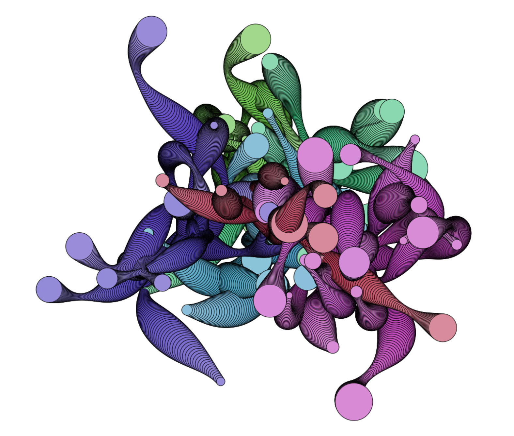
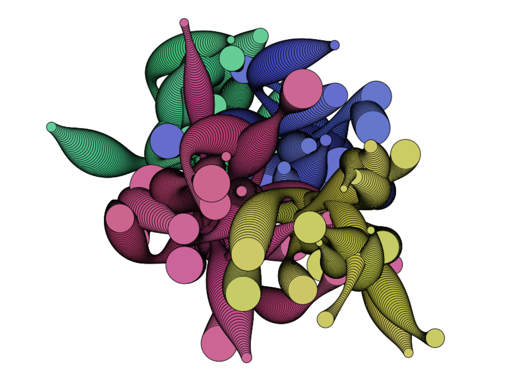
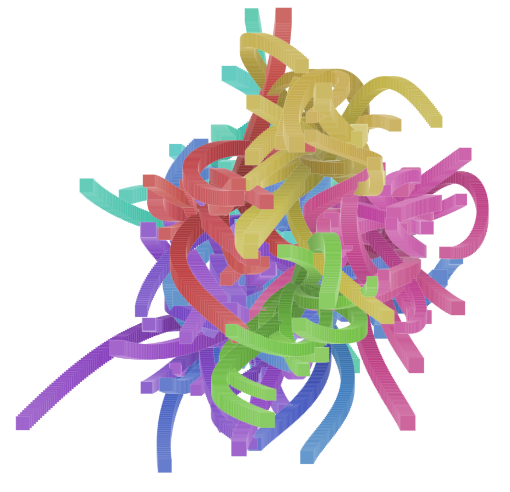
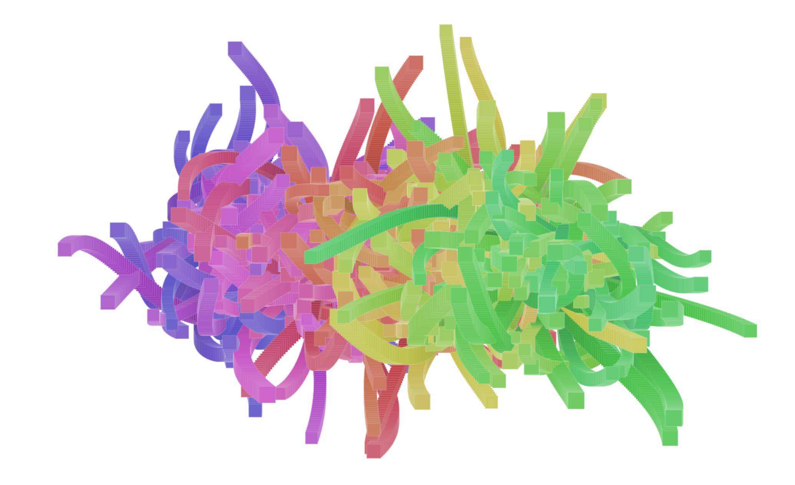
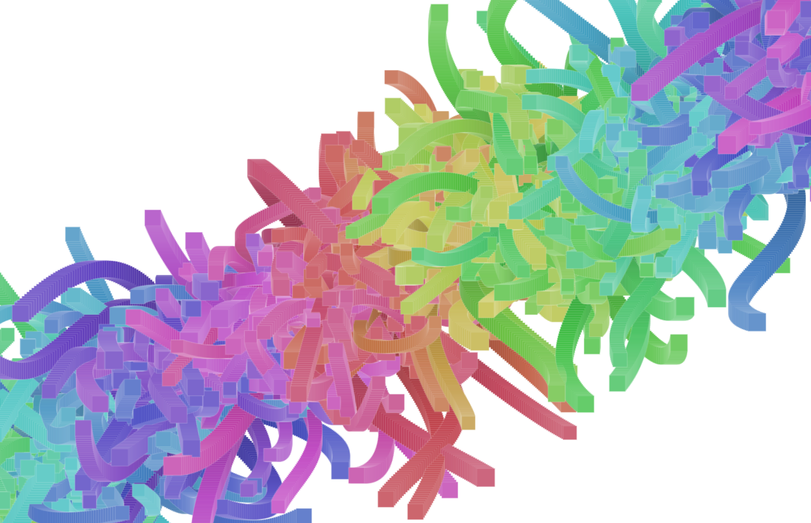

# Generative art

This repository contains some algorithms to for generative art, and some ideas.
Will update the readme properly later.

 * [Tubes demo](https://darkeclipz.github.io/generative-art/)

# Rocube

Rendered in Blender with Cycles.

# Tubes

Created with HTML Canvas, check `script.js` for more info.

## 001

## 002

## 003

## 004

## 005

## 006

